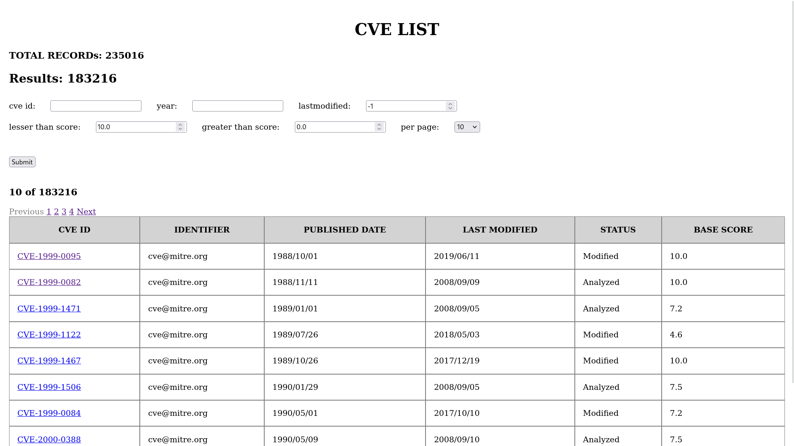
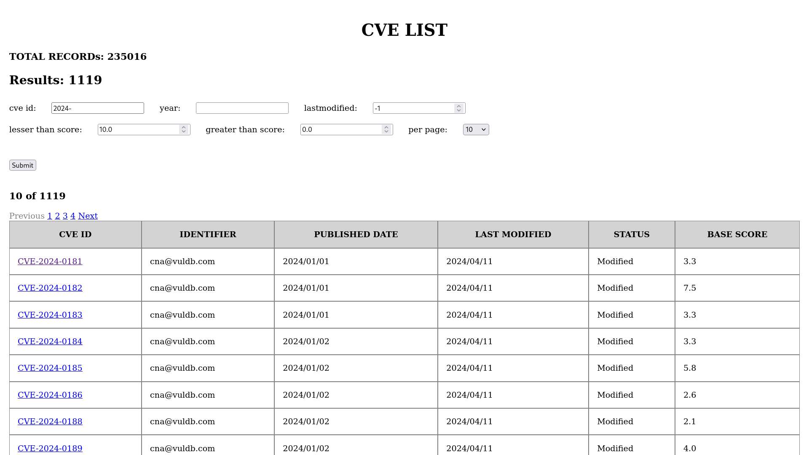
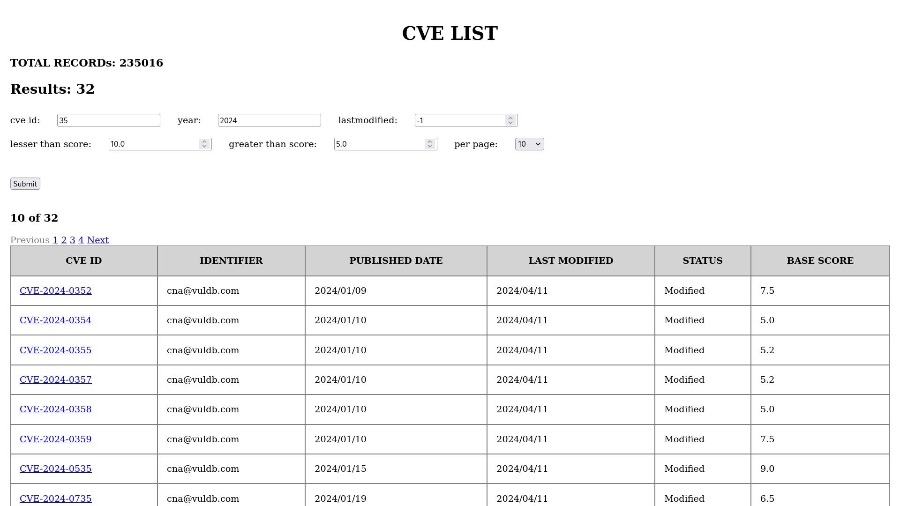
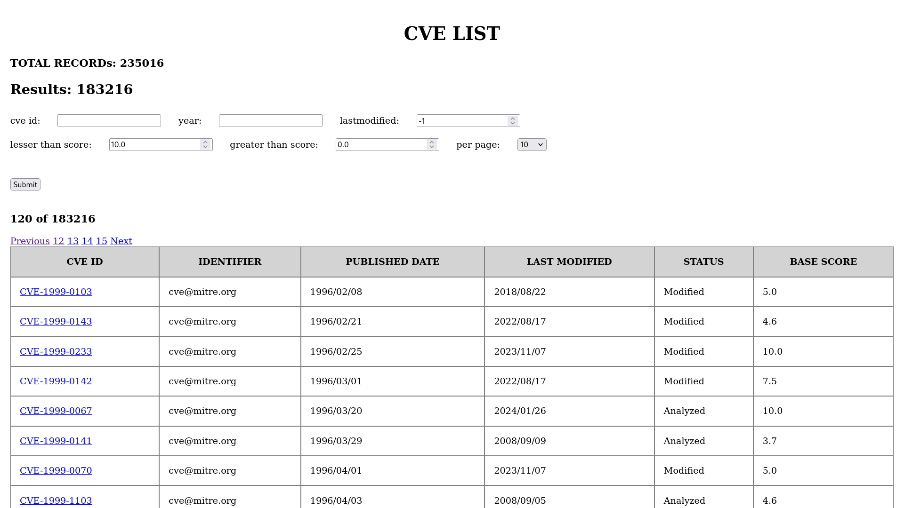
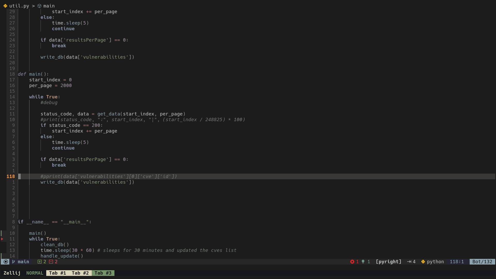
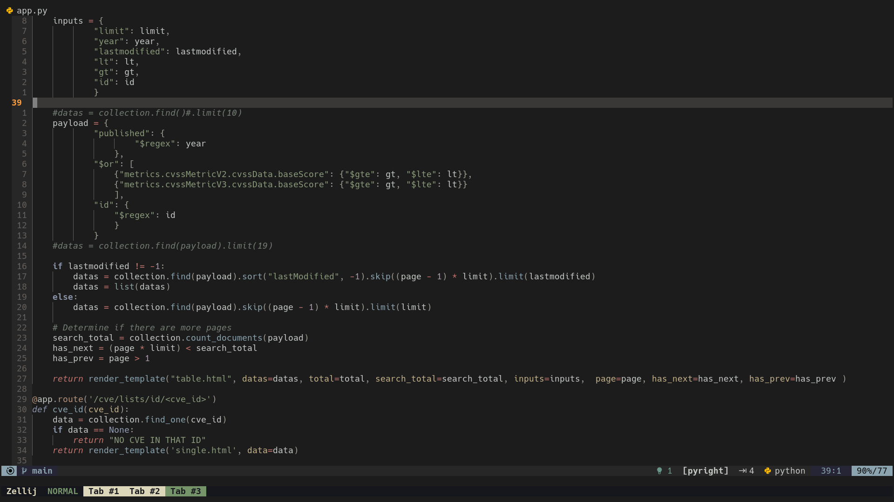
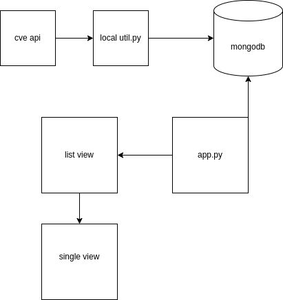

# SECURIN ASSESMENT


DATE: 2024-05-10

NAME: RITHESH S


## NVD - CVE API
The CVE API is used to easily retrieve information on a single CVE or a collection of
CVE from the NVD. Pls refer to the below NVD CVE documentation to get more
information


## TECH STACK

- `python flask`
- `mongodb`
- `docker`


## FUNCTIONALITIES

- Retrieve CVE information from the CVE API for all the CVE's batch wise using
    `startIndex` and `perPage` get parameters. [https://services.nvd.nist.gov/rest/json/cves/2.0](https://services.nvd.nist.gov/rest/json/cves/2.0)
    store all the CVE INFORMATION in local **MONGO DB**.
- Retrieve CVE changes from the CVE HISTORY API and update the changes in the local db 
- Removed **REJECTED** vulnerabilities from the database.
- Every 30 minutes it will query the HISTORY API for any changes and apply those changes
    to the local database
- All data are kept up-to-date with the server in an interval of 30 minutes. can be changed.
- Pagination on the **server side** is implemented
- Multiple Search filters are implemented can be using combined
    - cve id
    - year
    - baseScore

### API ENDPOINT

ENDPOINT :  **`http://<domain>:<port>/`**


##### `/` and `/cve/lists`

- Lists out the CVE INFORMATION from the database in a clean table.

###### GET PARAMETERS

- `?page=`
    - datatype: `int`
    - returns: returns the content of the page requested
- `?limit=`
    - datatype: `int`
    - returns: restricts the number of CVES in the page
    - options: `10, 50, 100`
- `?year=`
    - datatype: `string`
    - returns: returns all the CVES in that given year
- `?lastmodified=`
    - datatype: `int`
    - returns: sorts the table with last modified in descending order and limits it to the number of days given
- `?lt=`
    - datatype: `float`
    - returns: BaseScore value lesser that the input
    - ref - metrics.cvssMetricV2.cvssData.baseScore or metrics.cvssMetricV3.cvssData.baseScore
- `?gt=`
    - datatype: `float`
    - returns: BaseScore value greater that the input
    - ref - metrics.cvssMetricV2.cvssData.baseScore or metrics.cvssMetricV3.cvssData.baseScore
- `?id=`
    - datatype: `string`
    - returns: Searches the CVE id either completely or partially. `REGEX MATCHING`

`/cve/lists/id/<id>`

- returns the details of the specific CVE INFORMATION


### UI




### SEARCH 
The previous requests are saved and previous values or loaded after page refresh
```
{
    "limit": limit,
    "year": year,
    "lastmodified": lastmodified,
    "lt": lt,
    "gt": gt,
    "id": id
}
```






### CODE IMPLEMENTATION




On first time run the `util.py` it will populate the database by querying the CVE api endpoint
After the database is synced.
It will delete all the `REJECTED` vulnerabilities.
It will then wait for 30 minutes or specified time. to then query the history api
and make changes again
The last queried time is written to `config.json` and history after that time is then quried





```

payload = {
        "published": {
                "$regex": year
            },
        "$or": [
            {"metrics.cvssMetricV2.cvssData.baseScore": {"$gte": gt, "$lte": lt}},
            {"metrics.cvssMetricV3.cvssData.baseScore": {"$gte": gt, "$lte": lt}}
            ],
        "id": {
            "$regex": id
            }
        }
```

This sets the filter query paramter in the mongodb based on the input args from the `GET` parameters


## WORKFLOW



### LIST VIEW

You can see the list of CVES in `/` or `/cve/lists` endpoint.

You can **chain multiple search paramters** together to have a strong searching capabilities

Results per page can be configured

Results are paginated and previous and next page pagination are done server side

### SINGLE VIEW


View specific details about the CVE 


